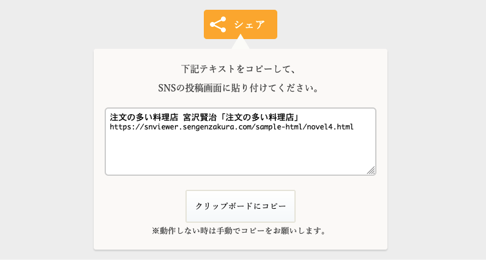

# NovelViewer Template

NovelViewer Template はWebサイトで利用できる小説ビューワーテンプレートです。

小説ビューワーは、HTML/CSS/JavaScriptで作成しております。

## ライセンス

Copyright (c) 2020 Aya Mizushiro
This software is released under the MIT License, see [LICENSE](/LICENSE).

## 変更履歴

[変更履歴はこちら](https://github.com/amizushiro/NovelViewerTemplate/releases)

## 機能

 * 横書き／縦書き表示
 * ゴシック体／明朝体表示（※Android は動作保証対象外）
 * 文字サイズの変更（小・中・大・特大の４種類）
 * 背景色の変更（白・黒・生成りの３種類）
 * ルビ表示
 * 圏点（傍点）表示
 * 縦中横
 * 挿絵表示
 * 目次表示
 * レスポンシブ対応

サンプル  &raquo;
[NovelViewer Template サンプル](https://amizushiro.github.io/NovelViewerTemplate/)

## 動作環境

* Google Chrome
* FireFox
* Microsoft Edge（Chromium版のみ）
* Safari（Mac OS, iPad OS, iOS）
* Android※1

※1：Android 端末を持っていないため、エミュレータでのみ動作確認をしております。

## 使い方

ファイルは「src」フォルダにあるものを使用してください。

1．`</head>`の直前にスタイルシートを挿入。  
「`./path/`」は環境に合わせて変更してください。

```html
<link rel="stylesheet" href="./path/css/snviewer.min.css">
```

2．`<body>`〜`</body>`内に下記を記述。

※v1.3で「`<div id="app"></div>`」→「`<div id="snv-app"></div>`」に変更されました。

```html
<div id="snv-app">
  <h1 id="nvl-title">
    シリーズタイトル
    <span id="nvl-subtitle">章タイトル（任意）</span>
  </h1>
  <h2 id="nvl-section-title">各話タイトル</h2>
  <div id="novel-body">
本文を
ここに書きます。
書き方の詳細は convert オプションの説明をご覧ください。
  </div>

  <!-- ローディング画面 -->
  <div id="snv-loading" class="snv-loader-wrapper">
    <div class="snv-loading">
      <span>Loading...</span>
    </div>
  </div>
  <!-- /ローディング画面 -->
</div>
```

3． `</body>`直前にJavaScriptを挿入。  
「path」は環境に合わせて変更してください。

※v1.3で「`new SNViwerAppClass()`」→「`new SNViewerAppClass()`」に変更されました。

```html
  <script src=./path/js/snviewer.min.js></script>
  <script>
    const viewerApp = new SNViewerAppClass();
  </script>
```

srcディレクトリ直下の「`template.html`」がテンプレートになっています。  
また、`sample-html`ディレクトリ以下に、サンプルファイルがあります。

基本的にはサンプルを参考に、テンプレートを使い回していただければ問題ないと思います。

___

表示フォントは下記の優先度となっております。

<dl>
  <dt>ゴシック体</dt>
  <dd>BIZ UDゴシック &gt; ヒラギノ角ゴシック &gt; 游ゴシック &gt; その他ゴシック体 </dd>
  <dt>明朝体</dt>
  <dd>BIZ UD明朝 &gt; ヒラギノ明朝 &gt; 游明朝 &gt; その他明朝体</dd>
</dl>

各OSでプリインストールされているフォントが異なるため、各OSで表示されるフォントは異なります。

表示するフォントを統一したい場合は、テンプレートに Google Font を追加するなどしてください。  
（設定方法はuseGoogleFontの項目にて説明）  
※GoogleFontを追加すると、ページの表示までに時間がかかる場合がございます。

##  オプション一覧

呼び出し時の引数にオプションを指定することで、いくつかの機能を有効／無効にできます。

| オプション名 | 入力値 | 説明 |
|-----------------|---------|------|
| indent | `true` / `false` | `true` の時、行頭一字下げを行います。デフォルトでは `false`。 |
| convert | `true` / `false` | `true` の時、記法（後述）の変換を行います。デフォルトでは `true`。 |
| useHtml | `true` / `false` | `<div id="novel-body"></div>`内にHTMLタグを記載する場合は `true` にしてください。デフォルトでは `false`。(v1.3で追加) |
| useGoogleFont | `true` / `false` | Google Font を手動で適用する場合は `true` を設定してください。デフォルトは `false`。(v1.3で追加)  |
| return | `string` | 閉じるボタンを押した時に遷移する URL。指定しない場合は閉じるボタンが非表示になります。 |
| ~~twitter~~ <br>useShare | `true` / `false` | `true` の時、シェアボタンを表示します。デフォルトは `false` です。(v1.3で変更) |
| indexList | `string` 連想配列 | 目次リスト。目次リストを指定しない場合、目次は生成されません。 |

example：

```html
<script>
 const viewerApp = new SNViewerAppClass(
    {
      indent: true,
      convert: true,
      useHtml: false,
      return: './index.html',
      useShare: true,
      useGoogleFont: false,
      indexList:
      {
         'ストーリータイトル1': 'ストーリー1 URL',
         'ストーリータイトル2': 'ストーリー2 URL'
      }
    });
</script>
```

## オプション詳細

### indent オプション

`true` の時、冒頭を全角空白で一字下げします。デフォルトは `false` です。  
「」、（）、『』は一字下げ対象外です。

自動インデント時は、前後の空白やタブは削除する仕様にしています。  
空白によって特殊なレイアウトを行っている場合は、このオプションを `false` にすることをお勧めします。

### convert オプション

`true` の時、本文を自動で段落タグで囲います。  
デフォルトは `true` です。

変換前  
```html
<div id="novel-body">
  ある晩、恭一はぞうりをはいて、すたすた鉄道線路の横の平らなところをあるいて居りました。
  たしかにこれは罰金です。おまけにもし汽車がきて、窓から長い棒などが出ていたら、一ぺんになぐり殺されてしまったでしょう。
  ところがその晩は、線路見まわりの工夫もこず、窓から棒の出た汽車にもあいませんでした。そのかわり、どうもじつに変てこなものを見たのです。
</div>
```

変換後  
```html
<div id="novel-body">
  <p>ある晩、恭一はぞうりをはいて、すたすた鉄道線路の横の平らなところをあるいて居りました。</p>
  <p>たしかにこれは罰金です。おまけにもし汽車がきて、窓から長い棒などが出ていたら、一ぺんになぐり殺されてしまったでしょう。</p>
  <p>ところがその晩は、線路見まわりの工夫もこず、窓から棒の出た汽車にもあいませんでした。そのかわり、どうもじつに変てこなものを見たのです。</p>
</div>
```
___

ダッシュを入力した場合、変換時にくっつく様にスタイルが自動であてられます。

変換前  


変換後  


___

また、一部ではありますが記法に対応しています。

使用できる記法は下記の通りです。

| 記法名 | 記法 | 変換後 |
|---------|------|---------|
|ルビ |｜漢字《かんじ》 |<ruby>漢字<rp>（</rp><rt>かんじ</rt><rp>）</rp></ruby> |
|圏点（傍点）|カクヨム記法<br>《《圏点》》<br><br>青空文庫記法<br>圏点［＃「圏点」は傍点］|   |
|縦中横|青空文庫記法<br>！？［＃「！？」は縦中横］|  |
|挿絵 |ノベルアップ＋記法<br>[/path/hanami_inu.png]<br><br>青空文庫記法<br>［＃altの説明（/path/hanami_inu.png、横93×縦100）入る］<br><br>※「path」は環境に合わせて変更してください。 | <br>画像は[いらすとや](https://www.irasutoya.com)より。|

ver.1.3 にて、タイトル部分もルビ変換に対応しました。  
 `id="nvl-title"`、`id="nvl-subtitle"`、`id="nvl-section-title"` を付与したHTMLタグで囲われたテキストが対象です。

圏点（傍点）の記号や色を変更したい場合は、下記の class にスタイルを指定することで上書き可能です。

```css
/* stylesheet */

/* 横書きのスタイル */
.snv-ltr .snv-emphasis {
  text-emphasis: filled dot;
}
/* 縦書きのスタイル */
.snv-rtl .snv-emphasis {
  text-emphasis: filled sesame;
}
```

圏点の種類や指定方法については、下記サイトを参考にしてください。  
[text-emphasis - CSS: カスケーディングスタイルシート | MDN Web Docs](https://developer.mozilla.org/ja/docs/Web/CSS/text-emphasis)

これらの機能を使わない、自分でHTMLタグを記述して整形する場合は、このオプションを `false` にしてください。

### useHtml オプション

本テンプレートは、`<div id="novel-body"></div>` 内に複雑なHTMLタグを配置することはあまり想定されていないため、`convert` オプションを使用する時に本文にHTMLタグがあると、不具合が起こる可能性があります。

原因としては、自動で本文に段落タグを挿入しているためです。

`<div id="novel-body"></div>` 内にHTMLタグを記載するが、記法の変換は使用したい場合はこちらのパラメータを `true` にしてください。記法の変換のみを行い、段落タグの自動挿入を行わなくなります。

~~※注意：`useHtml=true` に設定すると、ノベルアップ＋挿絵の記法は変換されなくなります。青空文庫記法か`` タグでの挿入をお願いいたします。~~  
2025/01/11 更新版から、`useHTML=true`でも、ノベルアップ＋挿絵の記法が変換できるようになりました。

### useGoogleFont

デフォルトでは、端末のプリインストールフォントを優先して使用し、Android 端末と判断できた場合のみ Google Font からフォントを追加します。  
（※Android は端末により明朝体が入っていないため）

好みの Google Font で全ての端末の表示を統一したい場合は、下記の通りに設定することで、反映することができます。

#### 1．Google Font の選択

Google Font から適用させたいフォントを選択します。  
Google Font の使い方は「Google Font 使い方」で検索してください。

#### 2．Google Font の読み込み設定

HTMLの `</head>` タグの直前に、Google Font の読み込み `<link>` を追加します。

```html
<head>
  <!-- ...省略... -->
  <!-- 小説ビューワーテンプレートのCSS -->
  <link rel="stylesheet" href="./path/css/snviewer.min.css">

  <!-- Google Fonts -->
  <!-- サンプルは、Noto Sans（ゴシック体）と、Noto Serif（明朝体）を追加しています。 -->
  <link rel="preconnect" href="https://fonts.googleapis.com">
  <link rel="preconnect" href="https://fonts.gstatic.com" crossorigin>
  <link href="https://fonts.googleapis.com/css2?family=Noto+Sans+JP&family=Noto+Serif+JP&display=swap" rel="stylesheet">
  <!-- /Google Font -->
</head>
```

#### ３．`font-family` の設定

CSS ファイルを置いているフォルダに `custom.css` を作成し、下記の通りに記載します。  
`font-family` に指定するフォント名は、使用するフォントに合わせて変更してください。

```css
/*  明朝体表示時に適用される書体 */
.snv-font-mincho {
  font-family: 'Noto Serif JP', serif;
}
/* ゴシック体表示時に適用される書体 */
.snv-font-gothic {
  font-family: 'Noto Sans JP', sans-serif;
}
/* 適用したフォントにより、本文の行間を調整したい場合 */
.snv-novel-block > p {
  line-height: 1.8;
}
```

#### ４.`custom.css` の読み込み

HTML の `</head>` タグの直前に、`custom.css` の読み込みを追加します。

```html
<head>
  <!-- ...省略... -->
  <!-- 小説ビューワーテンプレートのCSS -->
  <link rel="stylesheet" href="./path/css/snviewer.min.css">

  <!-- Google Fonts -->
  <!-- サンプルは、Noto Sans（ゴシック体）と、Noto Serif（明朝体）を追加しています。 -->
  <link rel="preconnect" href="https://fonts.googleapis.com">
  <link rel="preconnect" href="https://fonts.gstatic.com" crossorigin>
  <link href="https://fonts.googleapis.com/css2?family=Noto+Sans+JP&family=Noto+Serif+JP&display=swap" rel="stylesheet">
  <!-- /Google Font -->

  <!-- font-family の上書き（小説ビューワーテンプレートのCSSより後ろに追加） -->
  <link rel="stylesheet" href="./path/css/custom.css">
</head>
```

#### ５.`useGoogleFont` パラメータを有効にする

`SNViewerAppClass` の読み込み時のオプションに `useGoogleFont=true` を設定する。

```js
const viewerApp = new SNViewerAppClass(
{
  indent: true,
  convert: true,
  useGoogleFont: true,
});
```

### return オプション

戻り先URLを指定すると、指定したURLに戻る「閉じる」ボタンが表示されます。  
デフォルトでは戻り先がないため、閉じるボタンが非表示となります。

デフォルト表示  


オプションでURLを指定  


閉じるボタンは、本文の最後に表示されるものも対象です。


### ~~twitter~~ useShare オプション

`true` の時、シェアボタンを表示します。  
デフォルトは `false` です。

シェアボタン  


シェアボタン押下後

~~Web Share API が使用可能な場合は、ブラウザごとの共有画面が表示されます。（画像は Microsoft Edge の場合）~~  
※iOSやAndroid端末で [Web Share API が正常に動作しない不具合が報告されている](https://techblog.kayac.com/web-share-api-workaround)ため、現在 Web Share API 機能使用版を無効にしています。  
<!--  -->

Web Share API が使用不可な場合は、シェア用のテキストコピー欄が表示されます。  


### indexList オプション

指定すると目次リストを表示します。  
目次リストを指定しない場合、目次は生成されません。  
デフォルトは指定されていないため、表示されません。

記述サンプル  
```javascript
        indexList: 
        {
          '注文の多い料理店　序': 'novel1.html',
          'どんぐりと山猫': 'novel2.html',
          '狼森と笊森、盗森': 'novel3.html',
          '注文の多い料理店': 'novel4.html',
          '烏の北斗七星': 'novel5.html',
          '水仙月の四日': 'novel6.html',
          '山男の四月': 'novel7.html',
          'かしわばやしの夜': 'novel8.html',
          '月夜のでんしんばしら': 'novel9.html',
          '鹿踊りのはじまり': 'novel10.html'
        }
```

上記の表示サンプル  
  
「▼」がついているのが、現在表示しているページです。urlで判定しているため、打ち間違いにご注意ください。

___

また、目次リストを指定すると、前後の話に移動するリンクが自動で表示されます。

前話リンクのサンプル  


次話リンクのサンプル  


## お問い合わせ

不具合、使い方でわからないところなど、  
何かございましたら、下記連絡先よりご連絡ください。

* [お問合せ](https://xfolio.jp/portfolio/sengenzakura/free/342805)
* [Mastodon（@amizushiro@sengenzakura.com）](https://mstdn.sengenzakura.com/@amizushiro)
* [Bluesky（@sengenzakura.com）](https://bsky.app/profile/sengenzakura.com)

